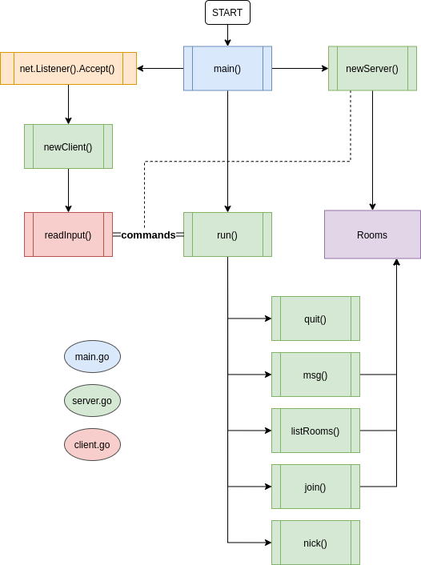

# Gochat

Simple TCP chat application made using Go.

This application was made alongside Alex Pliutau's 'Packagemain' youtube series.

## Parts

The whole application will consist of the following parts:

- client: current user and its connection
- server: which manages all incoming commands, as well it stores rooms and clients
- TCP server itself to accept network connections provided by 'net' package

## Installation

Install Go 1.16 and clone this repository and run:

```bash

go build

```

## Commands

Once the user connects to the chat server using `telnet` command line program, they can use the following commands to talk to the server:

- `/nick <name>` - get a name, otherwise user will stay anonymous.
- `/join <name>` - join a room, if room doesn't exist, the new room will be created. User can be only in one room at the same time.
- `/rooms` - show list of available rooms to join.
- `/msg	<msg>` - broadcast message to everyone in a room.
- `/quit` - disconnects from the chat server.

## Flow diagram


